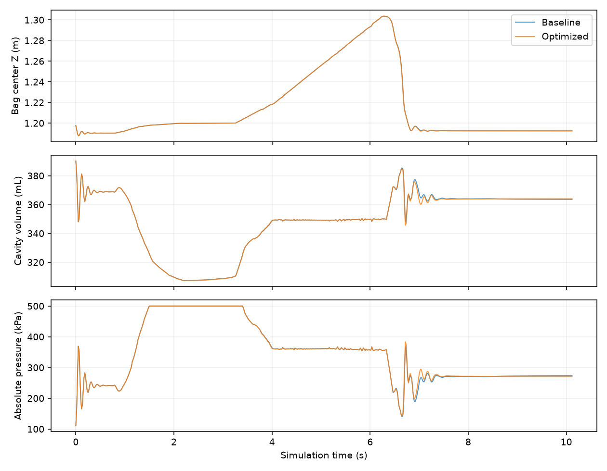

# Inflatable grasp throughput, 2026-09-14

> **Current state:** volume-feedback finger control has been removed at the user's
> request. The original finger controller is restored; IK fixes and computation
> optimizations remain. The passing-volume results below used the withdrawn
> controller and do **not** describe the retained version. See [retained version](retained.md).


**Historical update (control change withdrawn):** the second pass fixes the IK and excessive-compression
failures without relaxing acceptance thresholds. Complete grasp/release tests
now pass, with minimum volume ratios above 0.891 and maximum hand-root
position error approximately 0.0037 mm. See [the second-pass report](round2.md)
for current behavior, performance and reproduction commands.

The measurements below describe the initial performance-only pass, before the
acceptance fixes. Its 256-candidate cutoff is now 512.

Target: `mjvbd_v2_inflatable_bag_grasp`, baseline commit `37797903`.
Retain 216 particles, 428 triangles, 5 substeps, 12 sweeps, the original
plasticity, pneumatic parameters, full-surface contact searches and hand motion.

## Changes

- For at most 256 compact face candidates, distribute independent face searches
  into single-thread CUDA blocks. With 171 active candidates, the previous
  128-thread blocks concentrated the expensive SDF work in two blocks. A second
  kernel retains the original block size for larger batches. Both inspect the
  device count, so changing counts needs neither CPU readback nor graph recapture.
  Their count intervals are disjoint. CPU, noncompact and optional CUDA search
  override paths retain their existing dispatch.
- In the existing single-cavity incremental pressure/next-color-force kernel,
  replace a dummy tile reduction with a block barrier. The real volume reduction,
  pressure law and force/Hessian arithmetic are unchanged.

These optimizations live in the MJVBD V2 solver and its private collision
pipeline. The example requires no parameter changes. Other small full-surface
CUDA contact batches can also use the first change; the second applies only to
eligible single-cavity incremental pneumatic solves.

## Complete-scene measurements

RTX 5090 D v2, Warp 1.17.0, headless OpenGL at 1280×720, CUDA physics graph.
Each process executes all 608 frames (10.095 seconds of simulated choreography).
Exclude the first 30 frames from timing. Synchronize around step and render;
assertions and array downloads are outside these intervals. Compilation,
construction and diagnostic overhead are excluded. Run GPU jobs sequentially.

| Run | Step ms/frame | Render ms/frame | Step + render FPS |
| --- | ---: | ---: | ---: |
| Baseline 1 | 26.16 | 3.70 | 33.49 |
| Optimized 1 | 24.18 | 3.73 | 35.82 |
| Baseline 2 | 26.60 | 4.12 | 32.55 |
| Optimized 2 | 23.25 | 5.61 | 34.64 |

Average step time decreases from 26.38 to 23.72 ms, about **10.1%**.
Individual paired reductions are 7.6% and 12.6%. Rendering varied between
processes; these numbers are measured throughput, not guaranteed interactive
viewer FPS. In the first pair, the lift phase decreases from 28.85 to 24.28 ms.
See [raw timing summaries and failure lists](results.json).

On an identical captured scene input, sorted face-contact records agree exactly,
as do pressure, force and Hessian outputs. The isolated face probe decreases
from 1.41 ms to 0.52 ms in the initial block-size sweep; a later restored-buffer
probe measures 1.70 ms versus 0.82 ms. Those probes include identical buffer-copy
overhead and are not full-frame speedups. Do not extrapolate them to large meshes.

## Behavior and existing failures

All four runs complete grasp, lift and release. Peak bag center height ranges
from 1.303522 to 1.303667 m; final center height ranges from 1.192461 to
1.192527 m. Robot body transforms are identical. Maximum pressure remains
500 kPa and minimum volume ratios range from 0.791972 to 0.792058.



Long contact trajectories are not bitwise identical. Baseline repetition alone
has a maximum corresponding-particle difference of 10.68 mm; the first
baseline/optimized pair reaches 18.57 mm and the second reaches 9.30 mm.
Contact atomic append/reduction ordering changes. Peak and final heights being
close does not imply every transient wrinkle is identical.

**The original scene does not pass all of its own acceptance assertions.** All
four runs report the same 13 hand-root IK tolerance violations and one final
minimum-volume failure (required >0.85; measured approximately 0.792). The largest
reported IK error is 1.243 mm against a 0.5 mm threshold. No thresholds were
relaxed. Since this final failure skips subsequent plasticity assertions, the
reproduction script also checks finite states and plastic angle/stiffness bounds
independently. A fifth complete optimized run passes all four independent
finite-state and plasticity checks; its minimum volume ratio is 0.792294 and it
retains the same 14 original assertion failures. This is a performance change,
not a fix for those baseline defects.

## Validation and reproduction

- 11 pneumatic tests pass, including incremental/full-recompute agreement.
- 22 contact optimization, CUDA search and CUDA fast-path tests pass.
- New graph-reuse test covers candidate counts 0, 1, 256, 257, 258 and transitions
  back to empty/small batches, comparing sorted contacts with the original search.
- Compute Sanitizer `synccheck` on incremental pneumatic agreement: zero errors.
- Compute Sanitizer `memcheck` on the boundary/graph test: zero errors.

Run from the repository root, sequentially:

```bash
uv run --offline --no-sync docs/lab/mjvbd_inflatable_performance_2026-09-14/validate.py --baseline --output baseline
uv run --offline --no-sync docs/lab/mjvbd_inflatable_performance_2026-09-14/validate.py --output optimized
uv run --offline --no-sync -m newton.examples mjvbd_v2_inflatable_bag_grasp --viewer gl
```

The baseline option disables the new face dispatch and loads the original
pressure kernel from `git show 37797903:...`; it does not modify tracked solver
files. It is an A/B harness for this patch, not a general historical checkout.
Outputs are stored under `newton/tests/outputs/inflatable_perf/`: frame timings,
positions, body transforms, plasticity, volume, pressure and failed assertions.
Diagnostic runs collect the full sequence despite assertions and exit with
status 1 if any acceptance check failed. `--frames` permits short smoke runs;
`--trace` exposes frames 300–302 and 500–502 to Nsight's CUDA profiler API capture.
