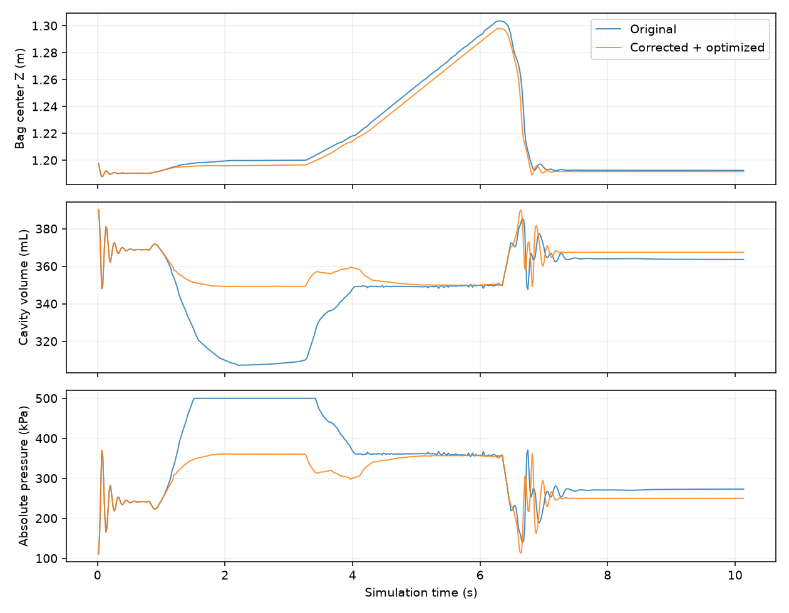
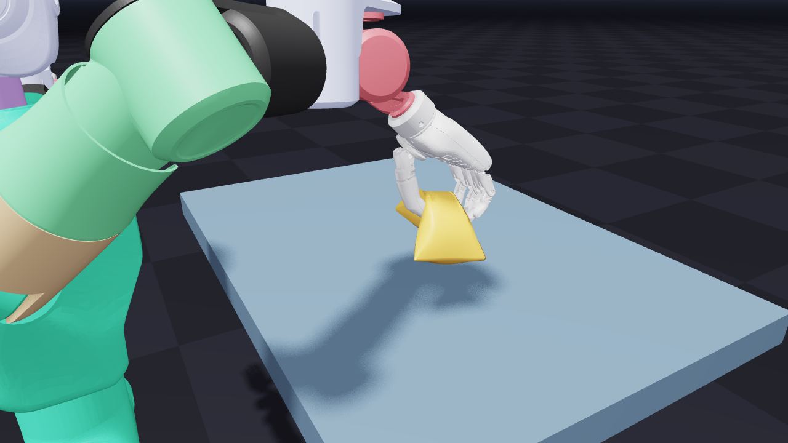

# Inflatable grasp: acceptance fixes and further performance work

> **Current state:** volume-feedback finger control has been removed at the user's
> request. The original finger controller is restored; IK fixes and computation
> optimizations remain. The passing-volume results below used the withdrawn
> controller and do **not** describe the retained version. See [retained version](retained.md).


The default complete scene now passes its original acceptance checks. The mesh,
materials, 500 kPa pressure ceiling, five substeps and twelve VBD sweeps are
unchanged. No particle projection, attachment or relaxed assertion is used.

## Fixes

**IK:** the old solve could move non-arm coordinates inside narrow soft limits,
then `_lock_q` restored those coordinates after the solve. That projection
invalidated the end-effector solution. A DOF mask now fixes non-arm coordinates
inside LM. CUDA solves eliminate the masked columns, retaining fourteen arm
DOFs. The original 24 runtime iterations remain.

**Compression:** the old contact-aware controller only slowed finger closure;
it kept moving toward the recorded closed pose even when the cavity was already
compressed. The plastic-bag demo now reduces closing speed between volume ratios
0.95 and 0.90, stopping further closure at 0.90 while hand contact is present.
This guard does not slow opening. Actual volume can undershoot the control
threshold as the bag moves, so the independent >0.85 acceptance check remains.
The root target trajectory is unchanged; final commanded finger angles can
change, intentionally, to avoid over-squeezing. The bag still lifts through
physical contact and falls after release. Other users of the support demo leave
this compression guard disabled by default.

## Performance changes

1. Capture the fixed 24-iteration IK calculation in its own CUDA graph. Update
   position and rotation target buffers each frame before replay. This removes
   repeated CPU kernel submission without changing LM arithmetic or iteration
   count. The existing no-graph option keeps eager IK execution.
2. Increase the small face-batch cutoff from 256 to 512. The grasp has about 271
   candidates and previously fell just outside the fast dispatch. An identical
   input probe measured 1.53 ms versus 0.52 ms, with exactly equal sorted contact
   outputs. Above 512, retain the original large-batch dispatch.
3. When self-contact is disabled, combine unit truncation-factor initialization
   and position updates in one kernel. Displacements and guard flags retain the
   reference behavior, including aliased position buffers and a null output.

These changes build on the initial pressure-barrier and face-dispatch work in
[the first-pass report](README.md). The largest additional end-to-end gain comes
from IK submission, not a change to the pneumatic force law.

## Controlled measurement

RTX 5090 D v2, Warp 1.17.0, two independent ViewerNull scenes, 608 frames each.
Both scenes use the corrected IK mask and compression controller. The reference
uses eager, noncompact IK, the 256-face cutoff and two-kernel untruncated updates.
The optimized scene uses the final computation paths. Alternate which scene
steps first on every frame; synchronize around each step. Exclude the first 30
frames and keep assertions outside timing. No GPU benchmark jobs run concurrently.

| Metric | Reference computation | Optimized computation |
| --- | ---: | ---: |
| Mean step time, excluding rendering | 22.10 ms | 15.10 ms |
| Step throughput, excluding rendering | 45.25/s | 66.23/s |
| Minimum volume ratio | 0.897410 | 0.891757 |
| Maximum root position error | 0.003465 mm | 0.003644 mm |
| Maximum absolute pressure | 369.01 kPa | 381.77 kPa |
| Bag center height after lift | 1.297548 m | 1.297523 m |
| Final bag center height | 1.191571 m | 1.192461 m |
| Complete original acceptance | Pass | Pass |

This is a **31.7% reduction in step time** (46.4% higher step throughput).
Earlier separate-process timings overstated the smaller pre-IK-graph gains;
use the alternating comparison above for the final performance claim. Contact
append/reduction ordering remains nondeterministic, so corresponding vertices
and transient wrinkles are not promised to be bitwise identical.

A separate complete 1280×720 headless OpenGL run measures 15.05 ms step +
2.89 ms render, about **55.7 FPS** excluding diagnostic downloads and assertions.
It passes all acceptance checks, with minimum volume ratio 0.897409. This is
measured throughput on this machine, not a guaranteed interactive viewer rate.



See [recorded results](round2_results.json). The original pre-fix failures were
up to 1.243 mm root error and approximately 0.792 minimum volume ratio, against
unchanged limits of 0.5 mm and >0.85 respectively.



## Validation

- 41 relevant tests pass, including the complete default grasp/release regression,
  pneumatic tests, contact/search/fast-path tests, truncation-cache tests and
  compact IK tests. The full-scene regression requires CUDA and the local W1 asset;
  both were available in this validation.
- The new full-scene regression checks every step and the final state, and verifies
  that the runtime IK graph was created. No scene assertion is suppressed there.
- A pre-fix diagnostic run reproduces the 0.605 mm IK violation at frame 20.
- Guard unit tests cover both signs of finger motion, continued opening, free
  motion without hand contact and disabled feedback.
- Face dispatch tests cover 0, 1, 256, 257, 512, 513 and 514 candidates in one
  reused graph, including transitions back to empty/small batches.
- New untruncated-update equivalence tests pass on CPU and CUDA. CUDA Compute
  Sanitizer memcheck reports zero errors for the new position-update path.
- Changed-file formatting and lint checks pass.

```bash
# Normal interactive acceptance by the user:
uv run --no-sync -m newton.examples mjvbd_v2_inflatable_bag_grasp --viewer gl

# Controlled alternating performance comparison; both variants must pass:
uv run --offline --no-sync docs/lab/mjvbd_inflatable_performance_2026-09-14/compare_compute.py

# Full rendered diagnostic sequence and screenshots:
uv run --offline --no-sync docs/lab/mjvbd_inflatable_performance_2026-09-14/validate.py --screenshots --output final

# Original pre-fix behavior, without editing tracked solver files (expected failure):
uv run --offline --no-sync docs/lab/mjvbd_inflatable_performance_2026-09-14/validate.py --baseline --output original
```

Raw arrays, assertions and timings are under
`newton/tests/outputs/inflatable_perf/`. `--reference-compute` selects the repaired
scene with the reference computation paths; `--baseline` restores the initial
pre-fix controller, IK and computation choices. These are patch-specific A/B
switches, not general historical checkout mechanisms.
