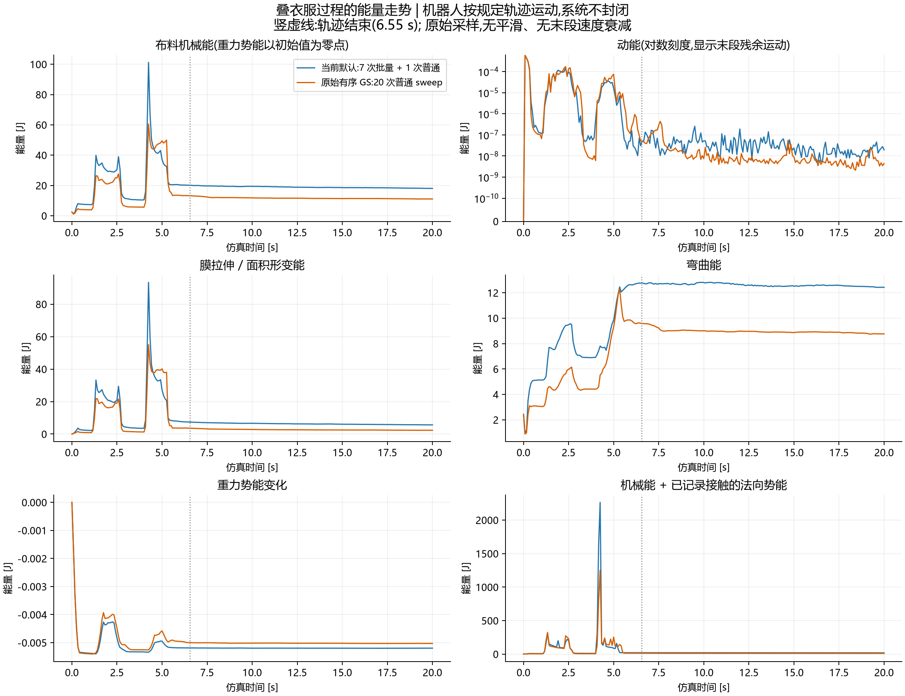
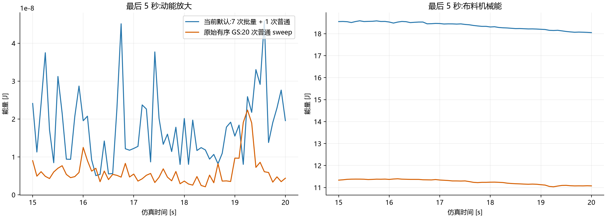
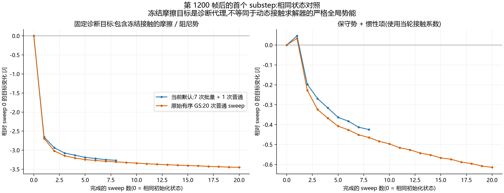

# 叠衣服默认方案与普通 20 sweep：能量诊断记录

日期：2026-09-09。基线分支 `FAST_MJVBDV2`，HEAD `cfe948b9`。
本次仅增加诊断脚本和记录，没有修改求解器、demo 默认参数或速度衰减。

## 对照设置

- 当前默认：`surface-fast`，7 次批量 sweep + 1 次普通 sweep，保留当前 Chebyshev/cache，multilevel 关闭。
- 普通 20 sweep：当前相同场景使用原始有序 GS 算法，关闭上述加速；不是切换到历史版本的整套 demo。
- 相同机器人轨迹、材料与接触设置，每帧 10 substeps，各运行 1200 帧（20 秒），每 5 帧采样。
- 轨迹在 6.55 秒结束。曲线无平滑，也没有额外末段阻尼。

## 完整仿真过程



布料机械能包含动能、重力势能、膜形变能和弯曲能。机器人是外部规定运动边界，会向衣服做功，所以这不是封闭系统总能量，不能要求全程单调下降。



| 指标 | 当前默认 | 普通 20 sweep |
| --- | ---: | ---: |
| 20 秒时布料机械能 | 18.04868146 J | 11.07383732 J |
| 最后 5 秒采样平均动能 | 1.77976177e-8 J | 6.10862275e-9 J |

本次默认方案的末段平均动能约为普通 20 sweep 的 **2.91 倍**，说明残余运动更多。但两条完整轨迹会分叉，末态能量差不能直接作为同状态求解误差，也不能单凭它确定抖动根因。

## 同状态 substep 内逐轮下降

取默认第 1200 帧之后首个已初始化 substep，恢复相同状态、惯性目标、anchor 和接触记录，分别执行默认 8 sweep 与普通 20 sweep。



| 固定诊断目标 | 能量 |
| --- | ---: |
| 两种方案相同初始值 | 21.59356364 J |
| 默认 8 sweep 结束 | 18.32741006 J |
| 普通 20 sweep 结束 | 18.14264678 J |

两者在这一次探针中都逐轮降低固定诊断目标；20 sweep 在第 8 轮后仍继续下降，最终比默认低约 0.18476 J。不能因此宣称默认已达到 20 或 30 sweep 的收敛水平。

左图包含冻结接触的摩擦/阻尼代理项，**不等同于动态接触求解器的严格全局势能**。右图只画保守势与惯性项，使用当轮接触系数，不要求逐轮单调。完整测量公式、假设和局限见 [METHODOLOGY.md](METHODOLOGY.md)。

## 校验、原始数据与复现

- 两个能量公式测试通过：接触势导数；膜/弯曲/阻尼能量有限差分与原始力 kernel 对照。
- 两套 demo 的最终检查通过；采样时 contact row overflow 均为 0。完整轨迹中最多观察到 1 个非对称 EE pair，故接触势仅作为记录集诊断；不构成无穿透证明。
- 这些运行有观测 readback，不作为性能基准。
- [默认轨迹 CSV](default_trajectory.csv)、[普通 20 sweep CSV](ordinary20_trajectory.csv)、[同状态逐轮 CSV](common_substep_sweeps.csv)。
- [诊断脚本](../../../scripts/plot_mjvbd_tshirt_energy.py)。

在仓库根目录执行：

```powershell
uv run --no-sync python scripts/plot_mjvbd_tshirt_energy.py --mode default
uv run --no-sync python scripts/plot_mjvbd_tshirt_energy.py --mode ordinary20
uv run --no-sync python scripts/plot_mjvbd_tshirt_energy.py --mode plot
uv run --no-sync python scripts/plot_mjvbd_tshirt_energy.py --mode self-test
```

脚本新输出在 `newton/tests/outputs/mjvbd_energy/`；本目录保存此次测量的持久副本，不受测试输出目录清理影响。
