# MJVBDV2 技术总览

> 面向机器人、刚体、软体、布料与气动薄膜的场景特化耦合求解器

本文基于 2026-08-27 的 `mjvbd_v2_pneumati` 分支，说明 MJVBDV2
当前已经实现的功能、物理边界、软件架构与性能工程。当前实现的逐项约束以
[MJVBDV2_PLAN.md](MJVBDV2_PLAN.md) 为准，性能数据以
[OPTIMIZATION_LOG.md](OPTIMIZATION_LOG.md) 为准；本文负责给出完整、易读的系统视图。

## 1. 一句话定位

MJVBDV2 不是把 MuJoCo 和 VBD 方程硬塞进一个巨型 kernel，也不是旧
`SolverMJVBD` 的简单重命名。它采用：

> **显式实体所有权 + 构造期场景特化 + 严格单向机器人代理 + 私有 VBD/碰撞快路径 + CUDA Graph 稳定执行。**

在一个混合场景中：

- MuJoCo 负责选中的机器人关节树及其连杆；
- VBD/AVBD 负责其余自由刚体、全部粒子、布料、四面体软体、弹簧和气动腔体；
- 动态机器人连杆以零逆质量的移动碰撞代理进入 VBD；
- VBD 内部的刚体、软体和布料彼此完整耦合；
- VBD 反力不回传给 MuJoCo，机器人轨迹不会被软体载荷改变。

这一取舍精准对应大量机器人操作任务：机器人轨迹由控制器或 MuJoCo 主导，环境需要
高质量地响应抓、压、折、撑、装袋和释放，但环境反力不需要反过来改变机器人动力学。

### 1.1 系统总览

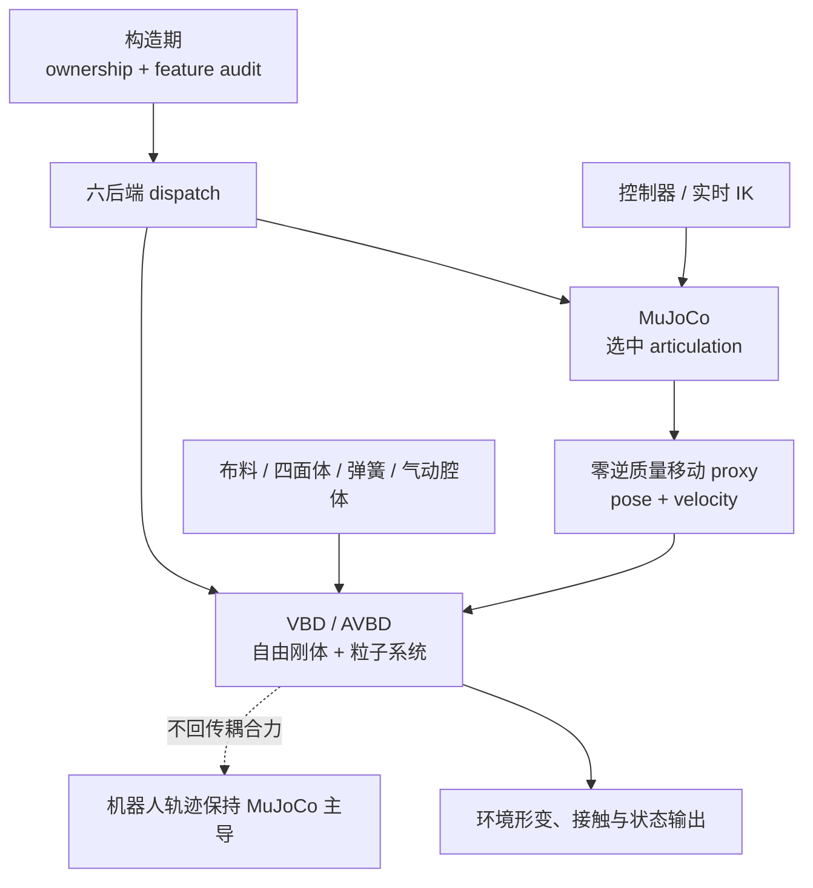

图中最重要的边界是单向 proxy：机器人和环境会在 VBD 侧发生接触，但 VBD 不通过耦合力
反向修改 MuJoCo 的广义坐标状态。不存在机器人或软体时，dispatch 会直接删除相应路径。

## 2. 功能范围

### 2.1 机器人与关节系统

- 选定 articulation 或闭合关节树由 MuJoCo 求解；
- 支持动态关节模式和外部给定位姿的 kinematic 模式；
- 动态模式保留 MuJoCo 的广义坐标动力学、驱动和关节约束；纯 MuJoCo 后端可保留
  MuJoCo 原生接触，耦合后端则避免 MuJoCo 与 VBD 重复拥有同一接触；
- kinematic 模式不构造 MuJoCo，直接把给定连杆作为 VBD 移动碰撞体；
- articulation-only 场景直接走纯 MuJoCo 或 kinematic passthrough；
- 只有纯 MuJoCo 后端允许 sleeping，动态耦合后端明确拒绝无唤醒通道的 sleeping。

### 2.2 刚体

- 未分配给 MuJoCo 的自由刚体由 VBD 私有实现中的 AVBD 路径求解；
- VBD 刚体之间、刚体与布料、刚体与四面体软体之间可在一次 VBD/AVBD 迭代中相互作用；
- 支持刚体接触、刚体—粒子接触和完整表面刚柔接触；
- kinematic 机器人连杆与动态 VBD 刚体可以共存，不需要启动 MuJoCo。

### 2.3 布料与薄膜

- 三角形膜内拉伸/剪切；
- 边弯曲；
- 粒子—刚体接触；
- 顶点—三角形和边—边自碰撞；
- 穿透抑制与 planar truncation；
- 可用于衣物折叠、塑料袋、悬挂布料、袋体装载等场景。

### 2.4 四面体软体和弹簧系统

- 四面体体积弹性；
- 表面三角形和四面体可以组合；
- 无四面体顶点自动进入 surface-only 快路径；
- 支持独立弹簧拓扑；
- 缺少某类拓扑时，不初始化对应模块，也不提交对应 kernel。

### 2.5 气动薄膜与密闭袋体

MJVBDV2 在完整 VBD 路径中提供可选气动腔体：

- 等温压力：`pV = constant`；
- 绝热压力：`pV^gamma = constant`；
- 目标体积势能；
- 外部给定表压；
- 体积、绝对压力、体积变化率和压力钳制状态输出；
- pressure scale、目标体积缩放和给定表压控制；
- world mask reset 和动态 MuJoCo—VBD 状态分发。

腔体直接复用已有闭合三角壳，不复制几何。构建时会验证闭合、可定向、双流形和单连通，
并统一外法线方向。普通非气动场景不会加载气动 kernel，也不会分配气动状态。

### 2.6 执行能力

- CPU 正确性路径和 CUDA 高性能路径；
- 固定容量、固定拓扑的 CUDA Graph 捕获；
- 多 world 候选对隔离；
- runtime 材料行选择，无需 CPU/GPU 往返或重新录图；
- deterministic、requires-grad 和小规模场景保留保守 fallback；
- `solver.features` 暴露实际选择的后端和每个求解模块是否启用。

## 3. 物理与耦合设计

### 3.1 为什么机器人交给 MuJoCo

机器人是典型的广义坐标关节系统。MuJoCo 擅长树形 articulation、关节驱动、约束和接触，
用它求解机器人可以避免把几十个受约束连杆重新表述为粒子或通用最大坐标软约束。

### 3.2 为什么环境交给 VBD/AVBD

[Vertex Block Descent](https://graphics.cs.utah.edu/research/projects/vbd/) 将隐式 Euler
的变分问题写成顶点级 block coordinate descent，并通过图着色执行并行 Gauss-Seidel 更新。
它适合布料、薄膜和体积软体的高刚度迭代求解。

[Augmented Vertex Block Descent](https://graphics.cs.utah.edu/research/projects/avbd/) 将这一思想
扩展到刚体、接触和关节约束。MJVBDV2 因而可以让 VBD 刚体、布料和软体共享同一个局部迭代
系统，而不是在多个求解器之间反复搬运这些对象。

### 3.3 严格单向不是缺陷，而是明确的模型合同

动态混合子步的数据依赖是：

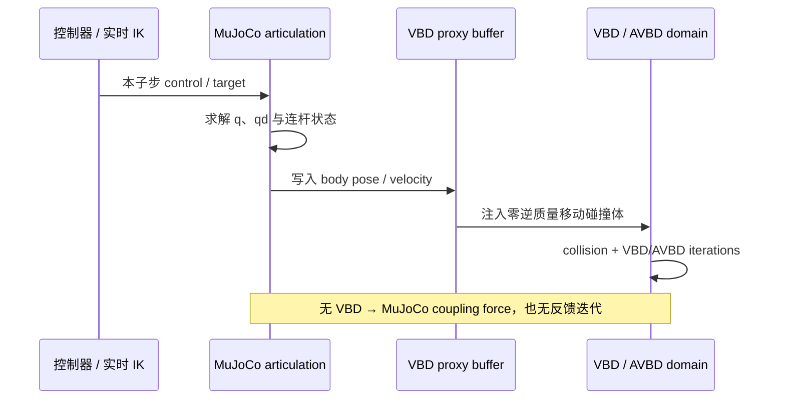

反向箭头被有意删除：

- proxy effective mass 被禁用；
- proxy relaxation 为零；
- coupling iteration 固定为一次 staggered pass；
- 不分配上一轮反馈缓存；
- coupling force 始终保持为零。

收益是耦合顺序明确、没有反馈迭代、没有代理质量调参、不会因软体接触扰动机器人控制轨迹。
代价是不能模拟“重物反作用让机器人手臂偏转”或“软体接触唤醒休眠机器人”。需要这种物理时，
应使用 Newton 原生双向 Proxy/ADMM 耦合，而不是偷偷改变 MJVBDV2 的语义。

## 4. 所有权：每个动态自由度只有一个写入者

`resolve_ownership()` 在构造时生成不可变分区：

1. `mujoco_articulations` 和 `mujoco_joints` 二选一；
2. 显式 joint 列表必须是 ancestor-closed 的完整关节树；
3. 选中关节的 child body 及闭合树所需的 parent body 归 MuJoCo；
4. 其余 body 归 VBD；
5. 全部 particle 归 VBD；
6. 三角形、弯曲边、四面体、弹簧和气动面随粒子所有权；
7. static world shape 对需要它的后端可见。

默认选择不是“所有 joint”。若模型只有 free/fixed joint，不会误启动 MuJoCo；无机械关节的
布料、袋子、软体和自由刚体场景直接进入 `pure_vbd`。

该分区避免了两类高风险问题：

- 同一个刚体被 MuJoCo 和 VBD 同时积分；
- 一个关节树被从中间切开，导致两边状态不闭合。

## 5. 六后端构造期特化

所有可确定的分支都在构造时决定，而不是每帧动态判断。

| 后端 | 触发条件 | 实际执行 |
| --- | --- | --- |
| `pure_vbd` | 没有关节交给 MuJoCo | 只构造 VBD/AVBD；普通 particle-only 场景优先使用 `vbd_soft/` |
| `kinematic_passthrough` | kinematic articulation，且无粒子和动态 VBD 刚体 | 不运行物理解算，只保留外部写入状态 |
| `pure_mujoco` | dynamic articulation，且无粒子和动态 VBD 刚体 | 只运行 MuJoCo，可选 sleeping |
| `mjvbd_kinematic_soft` | kinematic 连杆 + 粒子，无动态 VBD 刚体，`auto/soft` 接触 | 不构造 MuJoCo；稀疏粒子—shape 接触 + `vbd_soft/` |
| `vbd_kinematic_full` | kinematic 连杆 + 动态 VBD 刚体，或显式 `full` 接触 | 不构造 MuJoCo；完整 VBD/AVBD，连杆作为 kinematic collider |
| `coupled` | dynamic MuJoCo 关节 + 粒子或动态 VBD 刚体 | MuJoCo → 单向 proxy 同步 → VBD/AVBD |

这不是传统意义上的“某个分支 return 一下”。未选中的模块不会分配状态、构建邻接表、创建
碰撞缓冲或加载相应的 kernel。MJVBDV2 也不会退化调用旧 `SolverMJVBD`；六条路径均由
V2 私有后端实现。

### 5.1 后端选择图

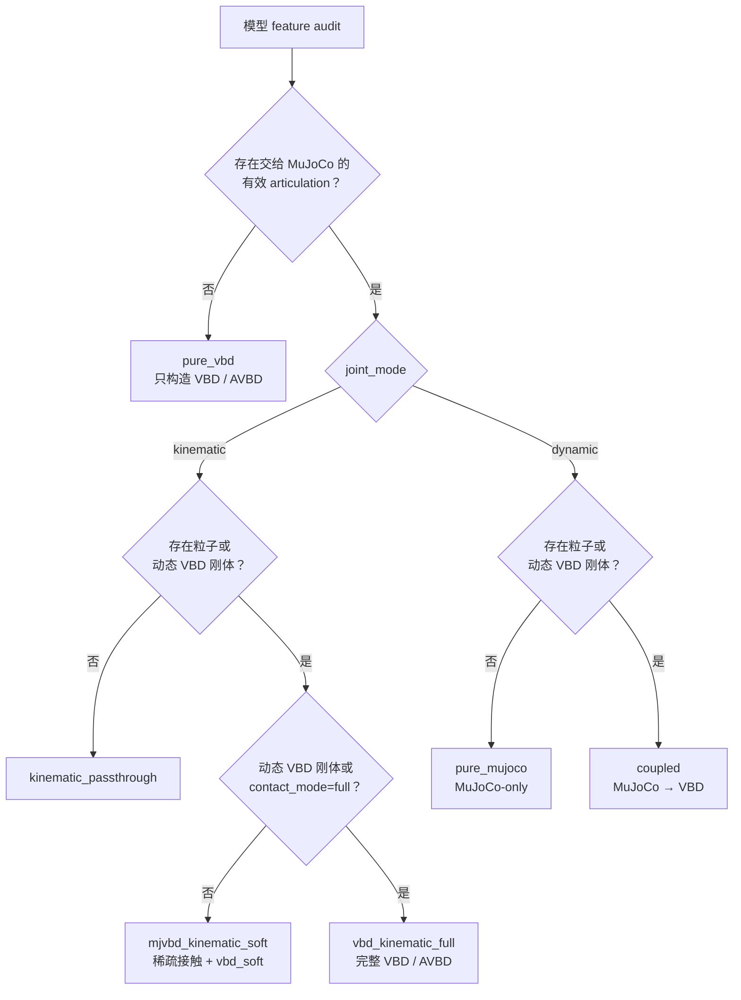

该决策只在构造时执行一次。运行阶段消费已经确定的 solver、容量和 kernel topology，避免
每个 substep 重复询问“场景里是否存在四面体、刚体或气动腔体”。

## 6. 软件架构

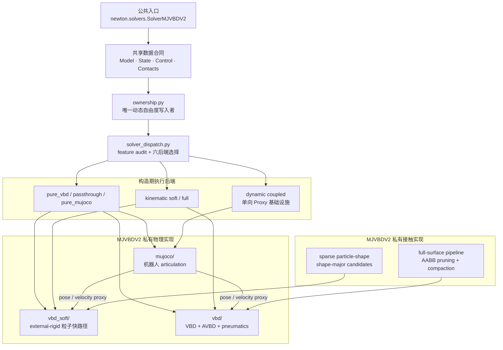

这张图同时标出了迁移边界：公共 API 和共享状态合同保持 Newton 兼容，场景分派、MuJoCo
适配、VBD kernel 与碰撞快路径集中在 `mjvbd_v2/` 内部。

### 6.1 两套私有 VBD 的原因

`vbd_soft/` 面向“外部刚体 + 粒子”的机器人布料场景。它不携带刚体 AVBD 和气动模块，
并包含针对粒子自碰撞和小 color group 的专用路径。

`vbd/` 是完整实现，负责动态 VBD 刚体、刚体接触、布料、四面体、弹簧和气动。只要场景
含动态 VBD 刚体、气动腔体或明确要求 full contact，就进入这一实现。

把二者分开比在一个大 solver 内长期保留大量 runtime `if` 更适合 CUDA Graph，也让
particle-only 场景不承担刚体和气动的状态成本。

### 6.2 独立迁移边界

MJVBDV2 的性能实现限定在 `newton/_src/solvers/mjvbd_v2/`。共享的 Newton `Model`、
`State` 和 `Contacts` 是输入合同；V2 不要求修改共享 collision 或 VBD 模块才能获得快路径。

这样设计有三个价值：

- 可将 MJVBDV2 作为独立求解器迁移；
- 不改变现有 Newton/MJVBD/VBD 示例的行为；
- 上游共享模块升级时，V2 的性能策略可以单独 A/B 和回退。

动态 `coupled` 后端仍复用 Newton 原生 Coupler 的状态分发与回收基础设施，这是经过实测
保留的选择；V2 专有的 ownership、代理语义、碰撞和 VBD kernel 则全部留在私有边界内。

## 7. 接触架构

### 7.1 `soft`：低成本粒子—shape 接触

适用于没有动态 VBD 刚体的布料/软体场景：

- 构造时过滤没有 `COLLIDE_PARTICLES` 标志的 shape；
- 只创建 world-compatible 的 particle/shape pair；
- CUDA 上以 shape-major 稳定排列，改善 transform 和 SDF 数据局部性；
- kinematic 路径使用旧粒子位置和本子步新连杆位姿，避免一帧接触滞后；
- active flag 和 active count 留在设备端，Graph replay 不读取 CPU。

该路径不能处理动态 VBD 刚体之间的接触，也不生成完整表面刚柔接触。

### 7.2 `full`：完整刚体、粒子和表面接触

适用于动态刚体装袋、齿轮挤压软体、手—塑料袋大面积接触等场景。V2 私有
`MJVBDV2CollisionPipeline` 在共享 collision 结果之上增加：

1. edge/shape 与 face/shape 候选按 shape-major 排列；
2. 用当前 feature AABB 和刚体 shape AABB 做保守相交测试；
3. 从刚体 AABB 中移除只服务于刚体 broad phase 的正 `shape_gap`；
4. 保留实际参与软接触阈值的 shape margin、soft margin 和粒子半径；
5. 将通过 AABB 的原始 pair index 压紧到固定容量设备数组；
6. 持久化 worker 只扫描 active prefix，再执行昂贵的 transform/SDF 优化；
7. 保留原 pair id、replay tid、接触阈值、SDF 迭代和输出字段。

因此快路径减少的是“不可能产生接触的 SDF 查询”，而不是减少真实接触、迭代次数或
接触精度。CPU、requires-grad 和不满足条件的场景自动走原始保守路径。

### 7.3 自碰撞

VBD 的顶点—三角形和边—边检测使用独立邻接/BVH 数据，后续求解按 graph color 执行。
当前实测表明复杂抓取阶段的主要剩余热点已经是 self-contact detection、force/Hessian 和
planar truncation，而不是 MuJoCo 或稀疏 point-contact broad phase。

## 8. 极致性能优化体系

MJVBDV2 的“极致”不等于无条件打开所有实验 kernel，而是遵守以下顺序：

1. **整模块消除**：不存在的功能不构造；
2. **构造期特化**：拓扑、所有权、color 和容量只分析一次；
3. **设备端动态选择**：active count、材料 phase 和接触 mask 不回读 CPU；
4. **数据局部性**：shape-major、surface-only 分组、连续 active prefix；
5. **固定 Graph 拓扑**：容量预分配，运行时只改变设备数据；
6. **按规模门控**：小场景、批量场景、dense contact 使用不同 kernel；
7. **语义保护**：不通过降低 substep、VBD iteration、自碰撞频率或接触半径冒充优化；
8. **实测否决权**：理论上减少工作但端到端变慢的方案直接回退。

### 8.1 性能优化分层图

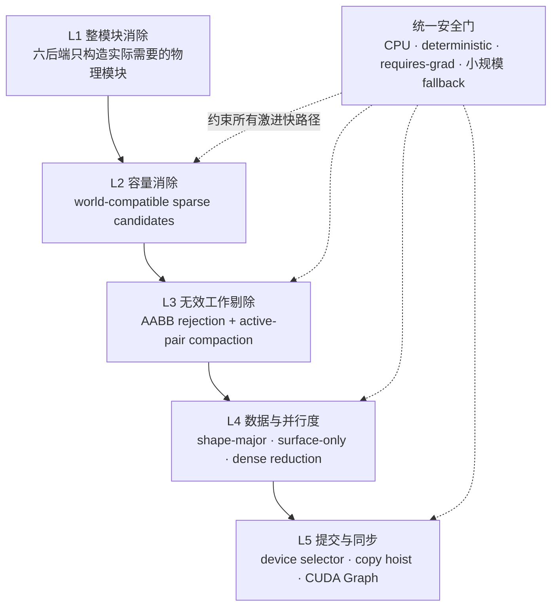

优化优先级从“根本不构造”开始，再依次减少容量、候选和内存流量，最后才处理 kernel launch。
这也是为什么一些减少 launch、却没有减少 GPU 主工作量的融合实验会被回退。

### 8.2 已保留优化与实测收益

除特别说明外，下列 A/B 数据来自 NVIDIA GeForce RTX 5090 D v2；不同场景、硬件和参数
不可直接相乘，也不能把局部 kernel 加速等同于整帧加速。

**动态 T-shirt，端到端：**

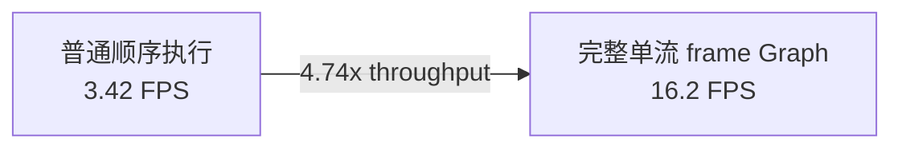

**Full-surface collision，相同接触 key：**

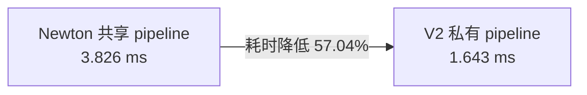

**稠密刚体—粒子接触，端到端：**

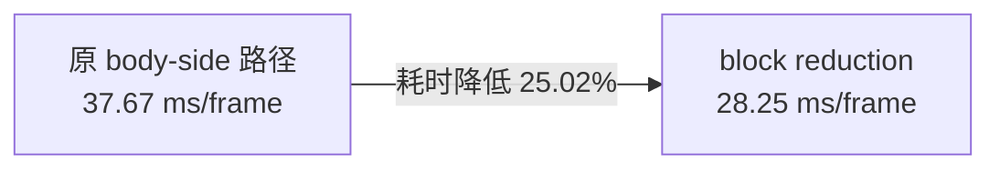

| 优化 | 作用路径 | 实测结果 | 语义约束 |
| --- | --- | ---: | --- |
| 完整单流 frame CUDA Graph | 动态 T-shirt 示例执行 | `3.42 → 16.2 FPS`，4.74x throughput | 粒子 bitwise equal；关节最大差 `5.37e-7` |
| 实时 IK 纳入 Graph | 动态 T-shirt 示例执行 | 24 次实时 IK 下 `14.7 FPS` | Graph/eager IK target 精确一致，900 帧测试通过 |
| 私有 full-surface AABB rejection | full contact collision | `3.826 → 1.643 ms`，碰撞阶段降低 57.04% | 9,838 个接触 key 不变 |
| AABB-active pair compaction | full contact | handoff collision 快 10.58%，整帧快 6.58%；气动碰撞快 60.54% | 固定容量、设备计数、Graph topology 不变 |
| 移除 soft AABB 中的 rigid-only `shape_gap` | Armadillo 抓取 | `6.34 → 7.00 FPS`；close 阶段 `4.10 → 5.51 FPS` | 不改变软接触阈值 |
| dense rigid-side contact block reduction | 完整 AVBD 刚体—粒子接触 | supermarket bag `37.67 → 28.25 ms/frame`，快 25.02% | 仅 nondeterministic CUDA、非梯度且 dense 时启用 |
| particle-color membership mask | 完整 VBD 粒子侧刚柔接触 | 冻结热点快 5.39%，handoff 整图快 6.99% | 接触顺序、color 顺序和力模型不变 |
| final particle copy hoisting + surface-only tile | 两套 VBD | supermarket bag 端到端快 3.27%～7.97% | 每步只最终复制一次；四面体顶点仍走通用路径 |
| fused truncation application | `vbd_soft/` self-contact | 1,800 次迭代图快 46.64%～46.77% | active/inactive 两条语义合并为一个设备选择 kernel |
| world-compatible capacity + batch-gated gather | 1,024 worlds | `8.402 → 7.998 ms`，快 4.81%；示例容量由 4 GiB 降至 4 MiB | 普通单场景保留旧 contact-parallel 路径 |

CUDA Graph 的价值与 NVIDIA 官方说明一致：重复工作流只在实例化时支付结构准备成本，后续
以很低的 CPU 提交开销重放。MJVBDV2 为 Graph 做的关键工作不只是调用 capture API，而是
把材料切换、active count、接触 compaction 和分支选择都改为设备端固定拓扑表达。

### 8.3 规模感知，而不是“一个 kernel 打天下”

- dense 刚柔接触：每 body 4 线程串行扫描适合稀疏接触；达到门槛后切到 64-thread chunk
  和二阶段 reduction。1,024 个接触的孤立热点为 25.23x，但端到端使用可信的 25.02%。
- 大 batch：linked per-particle gather 只有 color group 达到 `SM count * 128` 时启用；
  单场景中它可能降低 contact-level parallelism，因此保持关闭。
- 小 color group：tile 不能填满 GPU 时使用 scalar kernel；足够大时才使用 surface tile。
- deterministic 或 requires-grad：不启用会改变浮点 reduction 顺序或依赖原子的激进路径。
- 超过 32 个 particle color：不使用 32-bit color membership mask，回退到原扫描。

### 8.4 被实测否决的“看起来更快”方案

优化日志保留失败实验，防止重复踩坑：

| 候选方案 | 结果 | 为什么回退 |
| --- | ---: | --- |
| MuJoCo/VBD 双 CUDA stream 波前 | 代表性动态折衣慢 0.90% | 两者争用同一 GPU，event 与资源竞争高于可隐藏工作 |
| 融合 Coupler transfer | 慢 1.32% | 减少 launch，但未减少主要 GPU 工作 |
| per-particle exact CSR | handoff 整图慢 71.65% | 丢失 contact-level parallelism，串行 gather 代价更高 |
| per-color compact contact list | 仅快 0.21% | 构建和随机 gather 抵消收益，处于噪声内 |
| two-particle surface tile | 单场景慢 9.35% | 已有 surface-only tile 更适合当前拓扑 |
| full-VBD device-selected truncation | 小气袋仅快 0.59%，大袋无稳定收益 | 新 reduction/guard 成本不值得 |
| self-contact BVH 重建 | `3.312 → 3.319 ms` | 当前 refit 质量不是瓶颈 |
| 减小 self-contact block 外的多种 block size | block 16 仍最快 | 更大 block 增加寄存器/调度成本 |

这类“负优化”记录本身就是性能设计的一部分：MJVBDV2 追求的是端到端吞吐和可验证结果，
而不是代码层面看上去更复杂、kernel 数更多或理论操作数更少。

## 9. 与 Newton 原生方案对比

这里需要区分旧 `SolverMJVBD`、通用 `SolverCoupledProxy` 和
`SolverCoupledADMM`。它们解决的问题不同，不能简单按“新旧版本”排序。

| 维度 | MJVBDV2 | 旧 `SolverMJVBD` | 原生 `SolverCoupledProxy` | 原生 `SolverCoupledADMM` |
| --- | --- | --- | --- | --- |
| 目标 | 机器人 → VBD 环境的高性能专用组合 | 简单 rigid/external → soft 单向组合 | 任意支持 hook 的 solver 代理耦合 | 跨 solver 对称约束与接触 |
| 动态所有权 | MuJoCo articulation + VBD 自由刚体/全部粒子 | rigid 统一视为 external；VBD 主要推进粒子 | 用户按 Entry 任意划分 | 用户按 Entry 任意划分 |
| 反馈 | 严格无 VBD → MuJoCo 反馈 | 无 soft → rigid 反馈 | 可 lagged/staggered、迭代和反馈 | equal-and-opposite force、dual update |
| 后端特化 | 六后端；不存在的模块不构造 | `external/mujoco` 两模式 | 通用 entry/view/iteration 调度 | 通用 row discovery 与固定 ADMM iteration |
| VBD 动态刚体 | 支持，并与软体同一次 AVBD/VBD 求解 | 不作为主能力 | 取决于 Entry 配置 | 可跨 solver 建 row，但类型需显式支持 |
| 接触 | sparse soft + 私有 full/full-surface 快路径 | sparse particle-shape | 目的 solver pipeline 或外部 contacts | 私有跨 Entry rigid/particle contact row |
| 气动 | 四种压力模式，完整状态与控制 | 无 | 通用框架不内建；由子 solver 实现 | 通用框架不内建；需接口 row/子 solver 支持 |
| Graph 优化 | 固定 topology、设备 selector、私有 contact/VBD kernel | 基础 Graph 可用 | 固定迭代可捕获，但通用状态流更多 | 固定迭代适合捕获，但 row 与 dual 工作更多 |
| 通用性 | 专注两 solver、单向机器人操作 | 最简单 | 高，可接不同 solver 和 proxy 类型 | 高，适合真正双向约束 |
| 最适用 | 衣物、袋子、软体与 VBD 刚体被机器人操作 | kinematic 手与简单布料 | 需要代理反馈或不同 solver 组合 | 载荷必须反作用机器人、跨 solver joint/attachment |

### 9.1 执行路径对比图

**MJVBDV2：目标场景专用路径**

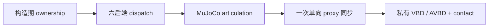

**Newton `SolverCoupledProxy`：通用代理路径**

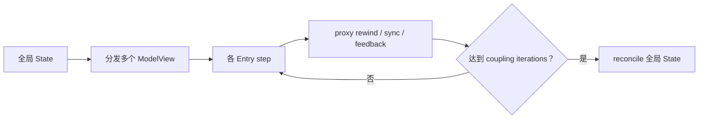

**Newton `SolverCoupledADMM`：双向约束路径**

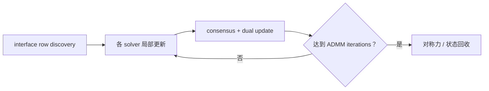

图中的节点数不是性能测量。它表达的是自由度和状态流：MJVBDV2 用固定的单向合同换取更小的
关键路径；Proxy/ADMM 则保留反馈、迭代和多 solver 组合能力。

### 9.2 相对旧 `SolverMJVBD`

MJVBDV2 的 kinematic soft 路径在单元测试中与旧 MJVBD 粒子结果以 `1e-7` 容差一致，
但 V2 增加了：

- 自动所有权分区；
- 无关节时纯 VBD；
- articulation-only 时纯 MuJoCo/passthrough；
- VBD 动态自由刚体；
- 完整刚柔表面接触；
- 气动腔体；
- 私有 CUDA 优化与规模门控；
- 可审计的 `features`。

因此 V2 是功能与执行架构的扩展，不是用另一种接口调用旧实现。

### 9.3 相对原生通用 Coupler

Newton 原生 Coupler 的优势是通用：`ModelView`、多 Entry 状态分发、proxy rewind/harvest、
effective mass hook 和 ADMM row 可以组合更多 solver，并支持双向反馈。MJVBDV2 不应替代它。

MJVBDV2 的优势来自收窄问题：

- 固定 MuJoCo → VBD 所有权；
- 固定一次 staggered pass；
- 删除反馈和 relaxation 状态；
- 让 kinematic 和 pure-VBD 场景避开动态 Proxy；pure-MuJoCo 只保留一个紧凑的单 Entry
  view，不构造 VBD 或 proxy iteration；
- 使用 V2 私有 contact/VBD kernel；
- 对布料、袋体、full-surface 和 dense body-particle 场景进行实测门控。

动态 `coupled` 后端仍复用通用 Coupler 的可靠状态分发/回收。曾经尝试进一步融合 transfer 和
新增专用 frame executor，但代表性折衣场景分别慢 1.32% 和仅快 0.52%（噪声范围），所以
没有为了“看起来更专用”而保留它们。

目前没有一组覆盖所有拓扑、严格同配置的 MJVBDV2 与通用 Proxy/ADMM 总体速度排名。
能够严谨声称的是：V2 结构上消除了其专用单向场景不需要的模块，并且私有热点已有上述
A/B 数据；不能把这些局部数据宣传为对任意 Newton Coupler 的统一倍数。

当前原生 `SolverCoupledProxy` 的通用 proxy loop 最多支持两个 solver Entry，但 Entry 中
使用的 solver、代理端点、反馈 hook 和迭代配置是通用的。MJVBDV2 同样是两个 Entry，却把
它们固定为 MuJoCo/VBD，并删除当前任务不需要的反馈自由度。

现有最直接的“V2 私有路径 vs Newton 共享路径”A/B 是 full-surface collision：在相同
frame-121 状态和相同 9,838 个接触 key 下，共享 `CollisionPipeline` 为 `3.825585 ms`，
V2 私有 pipeline 为 `1.643479 ms`，该碰撞热点耗时降低 57.04%。这是碰撞阶段对比，不能
替代整个通用 Coupler 的端到端对比。

## 10. 与业界方案对比

下表是架构与能力对比，不是跨引擎性能排行榜。不同引擎的材料模型、接触、容差和硬件路径
不同，没有同场景、同误差、同接触质量的基准时，不应宣称绝对快慢。

| 方案 | 核心表示 | articulation | 软体/布料 | 刚柔耦合 | MJVBDV2 的差异化 |
| --- | --- | --- | --- | --- | --- |
| MJVBDV2 | MuJoCo 广义坐标 + VBD 顶点 + AVBD 刚体 | MuJoCo | 三角壳、四面体、弹簧、气动 | VBD 域内完整；机器人到环境单向 | 保留机器人求解优势，同时为目标场景做六后端和私有 GPU 特化 |
| MuJoCo Flex | flex vertex 对应 body，edge constraint 或 continuum FEM | MuJoCo 原生 | 1D/2D/3D flex、接触和被动力 | 在 MuJoCo 约束系统内统一 | 更统一；MJVBDV2 则选择 VBD/AVBD 的局部隐式迭代和独立 GPU 优化边界 |
| PhysX 5 | reduced-coordinate rigid + FEM soft body + PBD particle system | PhysX articulation | FEM、PBD cloth/inflatable/fluid | 官方定位为统一双向耦合 | PhysX 功能面更广且提供原生双向统一耦合；MJVBDV2 更易在 Warp/Python 内定制求解和做场景私有 kernel |
| NVIDIA Flex | 所有材料统一为 particle + constraint | 非传统机器人 articulation 核心 | spring cloth、inflatable、fluid、shape-matching rigid | 粒子域内天然双向 | Flex 统一交互强；MJVBDV2 不把机器人和刚体都粒子化，保留 MuJoCo 机器人语义和 AVBD 刚体 |
| Newton Proxy/ADMM | 多 solver Entry + proxy 或 interface row | 由子 solver 决定 | 由子 solver 决定 | 可双向、多次迭代 | 通用性更高；MJVBDV2 为单向机器人操作删除通用成本并加入专用快路径 |

### 10.1 方案定位图

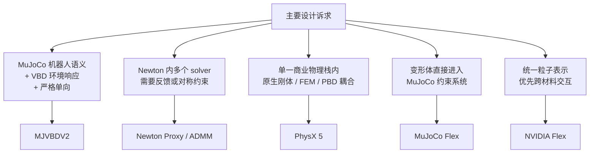

该图按表示方法和反馈需求定位方案，不表示性能排名。MJVBDV2 的位置很明确：它不争夺
“最统一”的定义，而是在 MuJoCo 机器人与 VBD 环境的单向操作任务中追求更短、更稳定的路径。

### 10.2 MJVBDV2 的优势场景

- 机器人手抓取、折叠、拖拽衣物；
- 刚体球、软体物体和袋体共同接触；
- 塑料袋、密封袋和气动薄膜；
- kinematic hand/robot 轨迹已经确定，环境响应是主要计算量；
- 需要保留 MuJoCo 关节控制，同时要求 VBD 处理复杂软体接触；
- 固定 topology、高 substep/iteration、适合 CUDA Graph 的长序列任务；
- 希望求解器能独立迁移，不修改 Newton 共享模块。

### 10.3 不应该选择 MJVBDV2 的场景

- 软体或重物反力必须明显改变机器人运动；
- 需要多个不同 solver 之间对称耦合；
- 需要跨 solver joint、attachment 或严格 equal-and-opposite force；
- 需要在 coupled 模式下 sleeping 并由 VBD 接触唤醒机器人；
- 需要统一流体、颗粒、断裂等 MJVBDV2 尚未包含的材料模型；
- 需要对 VBD 之外的全局高刚度问题做少迭代远距离传播。

VBD 论文也明确指出：局部 descent 对高分辨率、极端 stiffness ratio 和需要全局传播的问题可能
需要更多迭代；其 penetration-potential 接触也不是数学意义上的严格无穿透保证。MJVBDV2 的
优化不会消除这些算法边界。

## 11. CUDA Graph 设计

MJVBDV2 的 Graph 合同是：**容量固定，数据可变，拓扑不变。**

推荐顺序：

1. 注册自定义属性并 finalize model；
2. 构造 solver 及其 owned collision pipeline；
3. 运行至少一次未捕获 warm-up，让历史容量和 lazy kernel 完成初始化；
4. 捕获固定 substep/iteration 的完整 physics frame；
5. 运行时只修改预分配 device input、材料 selector、active count 和 control；
6. 不在 Graph 内分配、不 `.numpy()`、不依赖 host branch。

MJVBDV2 的完整动态折衣 Graph 将实时 IK、控制目标、材料 phase、十个 coupled substep 和每
substep 二十次 VBD iteration 放进一个单流依赖图。实测表明，在主负载已经占满同一 GPU 时，
单流 Graph 比双 stream 竞争更有效。

## 12. 使用接口

```python
import newton

builder = newton.ModelBuilder()
newton.solvers.SolverMJVBDV2.register_custom_attributes(builder)

# 添加机器人 articulation、自由刚体、cloth、tet soft body 或 pneumatic shell。
builder.color()
model = builder.finalize()

solver = newton.solvers.SolverMJVBDV2(
    model,
    joint_mode="dynamic",
    contact_mode="auto",
    vbd_options={"iterations": 12},
    mujoco_options={},
    collision_options={},
)

state_0 = model.state()
state_1 = model.state()
control = model.control()

solver.step(state_0, state_1, control, None, 1.0 / 120.0)
print(solver.features.backend)
```

构建新场景时应检查 `solver.features`，不要根据类名猜测实际路径。例如 joint-free cloth 应为
`pure_vbd`，kinematic robot + cloth 应为 `mjvbd_kinematic_soft`，dynamic robot + cloth 才应为
`coupled`。

## 13. 正确性与性能验证纪律

当前测试覆盖 ownership、闭合关节树、六后端分派、无反馈合同、旧 MJVBD 数值一致性、
VBD 动态刚体、模块裁剪、设备材料切换、CUDA Graph、完整表面接触等价、dense reduction、
world-compatible 容量、气动压力和 reset。

每个性能改动必须同时回答：

- 影响哪个 backend 和 topology；
- 减少的是容量扫描、真实计算还是 host launch；
- 接触集合、force law、color 顺序、substep 和 iteration 是否保持；
- deterministic、requires-grad、CPU 和小规模 fallback 是否正确；
- isolated hotspot 与 end-to-end frame 各提升多少；
- 是否完成代表性长序列场景验证；
- 若无收益，是否记录并回退。

因此，MJVBDV2 的优化目标不是“用更少迭代得到看起来差不多的动画”，而是在保持既定物理
离散和功能边界的前提下，减少无效候选、无关模块、重复内存流量、串行热点和提交开销。

## 14. 后续优化方向

### P0：保持接触集合的 self-contact 优化

复杂软体抓取阶段剩余最大热点是 edge-edge、vertex-triangle、自碰撞 force/Hessian 和
planar truncation。下一步必须保留 contact set，不能通过降低检测频率或半径换速度。可研究：

- detector 直接输出 compact active stream；
- 批量构建并保持 contact-level parallelism 的 color-aware layout；
- 更低成本的 refit traversal，而不是盲目重建 BVH；
- 接触持久化与安全失效判定。

### P1：气动体积增量更新

在保持每 color Gauss-Seidel 压力语义的前提下，缓存 face signed-volume contribution，只更新
当前 color 影响的面，再以差值更新 cavity volume。是否保留取决于气动热点 profile。

### P2：按工作负载选择异构执行

同 GPU 双 stream 在代表性场景已经被否决。只有当 trace 证明 MuJoCo/transfer 占比显著时，
才值得重新评估 CPU MuJoCo + pinned asynchronous upload 或多环境 MJWarp pipeline。

### P3：完善可重复 benchmark matrix

建立固定场景、固定状态快照和 GPU-time median，分别覆盖：

- dynamic robot + cloth；
- kinematic hand + full-surface bag；
- dynamic VBD rigid + cloth；
- tet soft body + self-contact；
- pneumatic shell；
- 1、16、256、1,024 worlds。

只有这一矩阵才能给出 MJVBDV2、旧 MJVBD 和 Newton 通用 Coupler 的严格总体速度对比。

## 15. 结论

MJVBDV2 的核心竞争力不是某一个快 kernel，而是一套贯穿物理、架构和执行层的专用化策略：

- 用 MuJoCo 保留机器人 articulation 的成熟动力学；
- 用 VBD/AVBD 统一求解环境中的刚体、软体、布料和气动薄膜；
- 用严格单向合同消除目标任务不需要的反馈迭代；
- 用六后端 dispatch 让不存在的功能真正零执行；
- 用私有、可迁移的 collision/VBD 路径实施 topology-aware GPU 优化；
- 用设备端动态选择和固定容量实现深度 CUDA Graph 化；
- 用端到端 A/B 数据决定保留或回退，而不是凭操作数猜性能。

它不是最通用的多物理耦合器，也不试图取代 Newton Proxy/ADMM 或 PhysX 的双向统一框架。
它追求的是更具体也更难的目标：在机器人操作复杂可变形环境这一类工作负载上，把每一份
不必要的状态、候选、kernel、host round-trip 和 solver branch 都从关键路径中移除，同时
保持接触集合、迭代语义和现有功能不变。

## 16. 参考资料

### 仓库内实现与设计

- [当前实现与设计约束](MJVBDV2_PLAN.md)
- [性能实验与回退记录](OPTIMIZATION_LOG.md)
- [历史示例基线](BASELINES.md)
- [Newton MJVBDV2 用户文档](../../../../docs/solvers/mjvbd_v2.rst)
- [Newton 原生 Coupled Solver 文档](../../../../docs/concepts/coupling.rst)
- [MJVBDV2 dispatch](solver_dispatch.py)
- [MJVBDV2 动态耦合实现](solver_mjvbd_v2.py)
- [MJVBDV2 私有 full-contact pipeline](full_contact_pipeline.py)

### 外部一手资料

- [Vertex Block Descent，SIGGRAPH 2024](https://graphics.cs.utah.edu/research/projects/vbd/)
- [Augmented Vertex Block Descent，SIGGRAPH 2025](https://graphics.cs.utah.edu/research/projects/avbd/)
- [MuJoCo deformable/flex modeling](https://mujoco.readthedocs.io/en/stable/modeling.html#deformable-objects)
- [NVIDIA PhysX PBD particle、cloth 与 inflatable](https://nvidia-omniverse.github.io/PhysX/physx/5.1.3/docs/ParticleSystem.html)
- [NVIDIA PhysX SDK 功能概览](https://developer.nvidia.com/physx-sdk)
- [NVIDIA Flex 官方手册](https://nvidiagameworks.github.io/Fle%58/1.2/lib_docs/manual.html)
- [NVIDIA CUDA Graph 编程指南](https://docs.nvidia.com/cuda/cuda-programming-guide/04-special-topics/cuda-graphs.html)
- [NVIDIA Warp runtime 与 Graph 文档](https://github.com/NVIDIA/warp/blob/main/docs/user_guide/runtime.rst)
