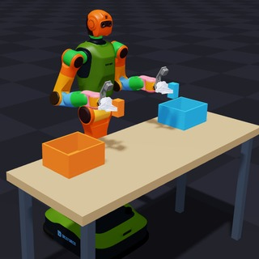

# MJVBDV2 demos

The modules in this directory are the scene entry points. Shared scene
implementations, pose/trajectory recorders, replay tools, and older variants
live in [`support/`](support/). Solver settings and scene trajectories are
unchanged by this directory reorganization.

Run a scene from the repository root:

```bash
uv run --extra examples -m newton.examples mjvbd_v2_tshirt_fold
uv run --extra examples -m newton.examples mjvbd_v2_conveyor_sorting --help
```

| Scene | Command name | Module |
| --- | --- | --- |
| W1 V030 two-gripper pick and place | `mjvbd_v2_w1_pick_place` | [example_mjvbd_v2_w1_pick_place.py](example_mjvbd_v2_w1_pick_place.py) |
| W1 T-shirt folding | `mjvbd_v2_tshirt_fold` | [example_mjvbd_v2_tshirt_fold.py](example_mjvbd_v2_tshirt_fold.py) |
| W1 tablecloth placement | `mjvbd_v2_tablecloth_place` | [example_mjvbd_v2_tablecloth_place.py](example_mjvbd_v2_tablecloth_place.py) |
| Dynamic W1 T-shirt folding | `mjvbd_v2_tshirt_fold_dynamic` | [example_mjvbd_v2_tshirt_fold_dynamic.py](example_mjvbd_v2_tshirt_fold_dynamic.py) |
| Bimanual nut and bolt | `mjvbd_v2_nut_bolt` | [example_mjvbd_v2_nut_bolt.py](example_mjvbd_v2_nut_bolt.py) |
| Cloth twist | `mjvbd_v2_cloth_twist` | [example_mjvbd_v2_cloth_twist.py](example_mjvbd_v2_cloth_twist.py) |
| W1 plug insertion | `mjvbd_v2_plug_socket` | [example_mjvbd_v2_plug_socket.py](example_mjvbd_v2_plug_socket.py) |
| W1 chair pushing | `mjvbd_v2_push_chair` | [example_mjvbd_v2_push_chair.py](example_mjvbd_v2_push_chair.py) |
| W1 bag transfer from a rod | `mjvbd_v2_bag_rod` | [example_mjvbd_v2_bag_rod.py](example_mjvbd_v2_bag_rod.py) |
| Soft-body gear crusher | `mjvbd_v2_gear_crusher` | [example_mjvbd_v2_gear_crusher.py](example_mjvbd_v2_gear_crusher.py) |
| Nonwoven bag table drop | `mjvbd_v2_bag_drop` | [example_mjvbd_v2_bag_drop.py](example_mjvbd_v2_bag_drop.py) |
| W1 conveyor sorting | `mjvbd_v2_conveyor_sorting` | [example_mjvbd_v2_conveyor_sorting.py](example_mjvbd_v2_conveyor_sorting.py) |
| W1 plastic inflatable bag grasp and release | `mjvbd_v2_inflatable_bag_grasp` | [example_mjvbd_v2_inflatable_bag_grasp.py](example_mjvbd_v2_inflatable_bag_grasp.py) |
| W1 soft-then-rigid cube placement into a bag | `mjvbd_v2_cubes_into_bag` | [example_mjvbd_v2_cubes_into_bag.py](example_mjvbd_v2_cubes_into_bag.py) |
| Right-hand Armadillo transfer into a gear crusher | `mjvbd_v2_armadillo_crusher` | [example_mjvbd_v2_armadillo_crusher.py](example_mjvbd_v2_armadillo_crusher.py) |
| PiPER steel ball into a hanging bag | `mjvbd_v2_piper_ball_into_bag` | [example_mjvbd_v2_piper_ball_into_bag.py](example_mjvbd_v2_piper_ball_into_bag.py) |

The T-shirt fold and cloth twist inherit the surface-fast displacement
deadband; use `--particle-displacement-threshold 0` to disable it.

### W1 V030 two-gripper pick and place

```bash
uv run --extra examples -m newton.examples mjvbd_v2_w1_pick_place
uv run --extra examples -m newton.examples mjvbd_v2_w1_pick_place --robot-only
uv run --extra examples -m newton.examples mjvbd_v2_w1_pick_place --viewer null --num-frames 900 --test
```



The `AssembleW1-030/DexforceW1V030/w1-030` robot simultaneously picks up two
blocks by approaching horizontally with its original parallel fingers. The
wrists point forward, cameras stay above the grippers, and elbows hang beside
the torso. It lifts the blocks 25 cm, moves outward to the two adjacent bins,
releases above the rims, then withdraws upward and backward.
`--robot-only` loads the original URDF zero pose (arms extended sideways) with
no task, table or IK, for inspecting the assembly and camera mounts.
The full 15-second run includes settling time. Blocks remain dynamic throughout.
Test mode checks both lifts, finite states, TCP tracking, joint velocity,
and each released block's full bounds and resting height inside its bin.
Use `--no-cuda-graph` to run without graph capture.
See [asset provenance and physical assumptions](assets/w1_v030/README.md).

### Conveyor sorting

```bash
uv run --extra examples -m newton.examples mjvbd_v2_conveyor_sorting --num-frames 9000
```

The workstation uses Blender-authored industrial equipment with rounded trays,
aluminum extrusions, a gearmotor, control cabinet, and cables. The idle left arm
rests beside the torso with relaxed fingers. The head tracks the current parcel
through feeding, grasping, transfer, and release, with bounded neck speed and
acceleration. The editable authoring script and runtime meshes are documented in
[the workstation asset guide](../../../assets/conveyor_station/README.md).
Blender is needed only to rebuild the asset, not to run the demo.
The conveyor renders a continuous 4 mm belt around both end drums, with rubber
texture moving along the entire loop and synchronized rotating hubs. Take-up
screws, lock nuts, end guards, and a return guard pan complete the mechanism.
Overlapping flat contact sections are clipped at the end tangents; rotating
cylinders provide the curved contact surface around both end drums.

The W1 sorts a rigid block, a volumetric soft block, woven cloth, and a
sealed pneumatic parcel into labeled trays on a shared workbench. The
cloth uses a 25 x 40 cm tray to accommodate draping and placement variation,
the soft block uses a 19 x 25 cm tray, and the other trays are 25 x 25 cm.
Collision geometry and placement checks use the same dimensions.
The scene includes textured belt treads, fabric stitching, package printing,
concrete flooring, and OpenGL lighting tuned for the workstation.

The controller retimes complete joint motion segments to respect the source
URDF velocity limits and keeps a three-degree margin inside both arms' position
limits. URDF finger velocities are zero; `--finger-speed 90` supplies an explicit
demo fallback in degrees/second. This is not a measured hardware finger limit.
The cloth uses a 5 mm mesh with unchanged total mass, a calibrated thumb/index
pinch approached from below, and an elevated transfer over the neighboring trays.
The notched worktop leaves space below the hanging edge. Test mode also checks
robot clearance independently of the simulation's self-collision filters.
These checks do not establish hardware acceleration, torque, or continuous
collision feasibility.

The mixed-material scene uses the full VBD backend. Its scene-local
`--cloth-displacement-threshold` filters small solved cloth displacements
per 60 Hz simulation frame near the receiving tray after placement is
verified and the hand has withdrawn; set it to `0` for comparison. It does
not change particle masses or disable collisions. Velocity is reconstructed
from the accepted position, and subsequent forces can move the cloth again.
The default is 0.5 mm; the effective threshold is also capped at
`0.25 * gravity * frame_dt**2` so unsupported cloth continues to fall,
independently of the substep count. Test mode additionally requires the
released cloth's RMS speed to average below 2 mm/s over the last second.
The other materials and other demos are unaffected by this filter.

## Conveyor recording and 60 FPS replay

Record the full simulation once (no rendering by default):

```bash
uv run --offline --no-sync -m newton.examples.mjvbdv2.support.conveyor_record --test
```

Play the resulting 60 Hz states with the original camera controls and materials:

```bash
uv run --offline --no-sync -m newton.examples.mjvbdv2.support.conveyor_replay --loop
```

Both commands default to `newton/tests/outputs/conveyor_recording`. Use
`--recording <directory>` on both commands for another recording. The recorder
requires a new directory and never overwrites existing recordings. It waits at least
120 frames after all four placements, then stops once final validation passes,
with a default ceiling of 9,000 simulation frames. `--test` additionally checks robot clearance each frame.
A shorter `--num-frames` or a keyboard interruption preserves a partial cache;
its metadata identifies that it is incomplete.

Replay loads body poses, deformable vertices, belt travel, and parcel status
from disk-mapped NumPy arrays. It constructs neither IK nor physics solvers.
The cache is visual playback data, not a checkpoint for resuming simulation.
Topology and shape mismatches are rejected; the original repository assets are
still required. Record again after changing the scene geometry.

Playback advances one recorded frame per tick, paced at 60 FPS. It uses the
viewer's pause and single-step controls; `--start-frame N` selects a starting
frame and `--loop` restarts at the end. `--num-frames N` caps display frames.
If the renderer cannot sustain 60 FPS, playback slows without skipping states.
On the development RTX 5090 D v2, a standalone 600-frame headless GL replay
took 10.025 s (59.85 FPS); an uncapped 300-frame run reached 72.2 FPS.
A full recording with per-frame assertions and final validation passed with
5,487 cached frames (including the initial state), covering 91.43 simulation
seconds. Cache round-trip, partial-prefix, geometry mismatch, overwrite
protection, and solver-free rendering were also checked.
These measurements include frame restoration and rendering, excluding scene
construction, with the recorder paused. Running physics concurrently competes
for GPU resources and can reduce playback speed.

`--unthrottled` measures available render throughput without pacing. For a
headless rendering benchmark, also pass `--headless --num-frames 600`.

## Support modules

The modules under `support/` remain available for imports and recording
workflows, but do not appear in `python -m newton.examples --list`.
Run a support tool by its complete module path, for example:

```bash
uv run --extra examples -m newton.examples.mjvbdv2.support.example_mjvbd_v2_dexforce_bimanual_plastic_bag_pose_recorder --help
```

Local URDFs and recorded trajectories still resolve from the repository
`assets/` directory. Moving a module does not move or rename its data files.

## Name migration

Old top-level command names are replaced by the names below. Prefix a module
filename with `example_` and append `.py` to obtain its source filename.

| Previous command | Current command |
| --- | --- |
| `mjvbd_v2_gear_crusher` | `mjvbd_v2_gear_crusher` |
| `mjvbd_v2_nonwoven_bag_table_drop` | `mjvbd_v2_bag_drop` |
| `vbd_mjvbd_v2_dexforce_recorded_soft_then_rigid_cube_into_bag_final00` | `mjvbd_v2_cubes_into_bag` |
| `cloth_mjvbd_v2_dexforce_bimanual_place_tablecloth_waic_house` | `mjvbd_v2_tablecloth_place` |
| `mjvbd_v2_cloth_twist` | `mjvbd_v2_cloth_twist` |
| `cloth_mjvbd_v2_dynamic_dexforce_bimanual_fold_tshirt_waic_house` | `mjvbd_v2_tshirt_fold_dynamic` |
| `mjvbd_v2_w1_conveyor_sorting` | `mjvbd_v2_conveyor_sorting` |
| `mjvbd_v2_bimanual_nut_bolt` | `mjvbd_v2_nut_bolt` |
| `mjvbd_v2_dexforce_realtime_push_chair` | `mjvbd_v2_push_chair` |
| `vbd_mjvbd_v2_dexforce_recorded_plastic_inflatable_bag_pick_release_final00` | `mjvbd_v2_inflatable_bag_grasp` |
| `mjvbd_v2_dexforce_realtime_plug_socket` | `mjvbd_v2_plug_socket` |
| `mjvbd_v2_dexforce_w1_bimanual_plastic_bag_rod_final00` | `mjvbd_v2_bag_rod` |
| `vbd_mjvbd_v2_right_hand_armadillo_into_gear_crusher_final00` | `mjvbd_v2_armadillo_crusher` |
| `cloth_mjvbd_v2_dexforce_bimanual_fold_tshirt_waic_house_final00` | `mjvbd_v2_tshirt_fold` |

Other previous `mjvbdv2` modules retain their filenames under `support/`,
except the non-importable `..._v0.1.py` variant, now named `..._v0_1.py`.

### PiPER steel ball into a hanging bag

```bash
uv run --extra examples -m newton.examples mjvbd_v2_piper_ball_into_bag
uv run --extra examples -m newton.examples mjvbd_v2_piper_ball_into_bag --viewer null --num-frames 600 --test
```

This ports the WAIC desk, rack and PiPER assets, using the reference FBD_03
bag with 2,588 vertices and 4,999 triangles. The arm
approaches the original 0.058 kg ball, closes its jaws, lifts and transfers it,
then opens above the bag. MJVBDV2 solves the sphere and cloth dynamically;
there is no sphere attachment. The original base height and rack are preserved, with no pinned bag vertices.
See [asset provenance and physical assumptions](../../../assets/piper_bag/README.md).

The default uses 10 substeps and 15 local VBD sweeps with rigid-soft DAT and
contact-aware Chebyshev acceleration. DAT constrains extrapolated updates and
marks clipped particles so subsequent acceleration excludes them. Use
`--cloth-acceleration none` for the ordinary DAT baseline, or
`--no-rigid-soft-dat --cloth-acceleration none` to disable both. The release target
stays above the bag even when the pickup point moves.
The coarse bag uses edge/face contacts against SDFs of the original rack and ball
meshes so rods and the ball cannot simply pass between cloth vertices. These
SDFs require CUDA. Test mode also checks that both handles stay on the rack.

The bag's bending recovery can be adjusted with `--bending-stiffness` (default
`5e-5`; use `5e-7` to compare the earlier softer response). The membrane
stiffness remains independently controlled by `--membrane-stiffness`.
