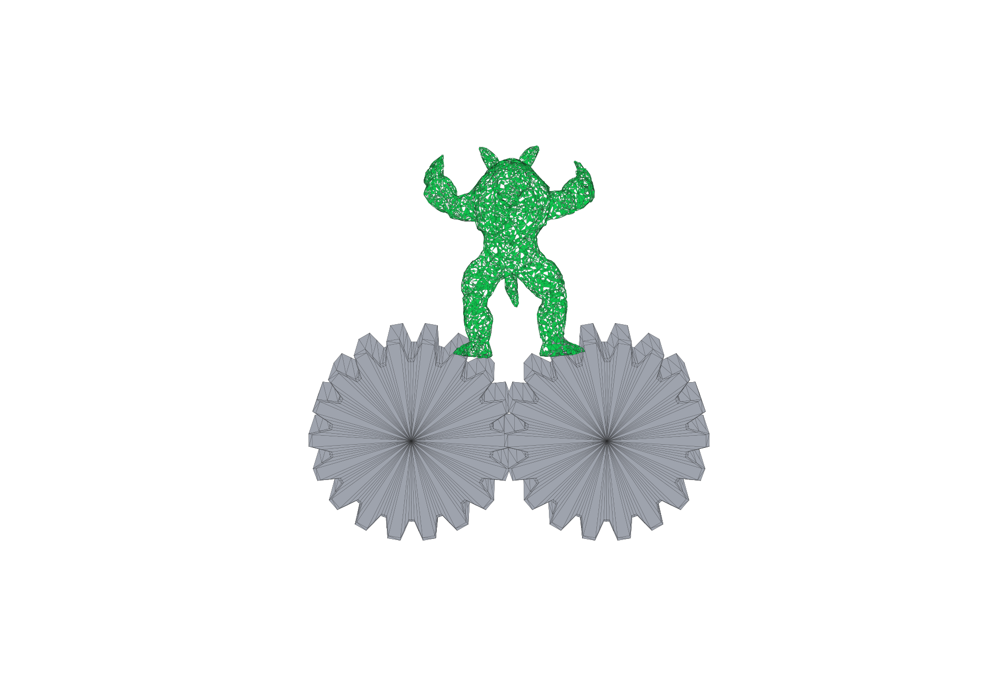
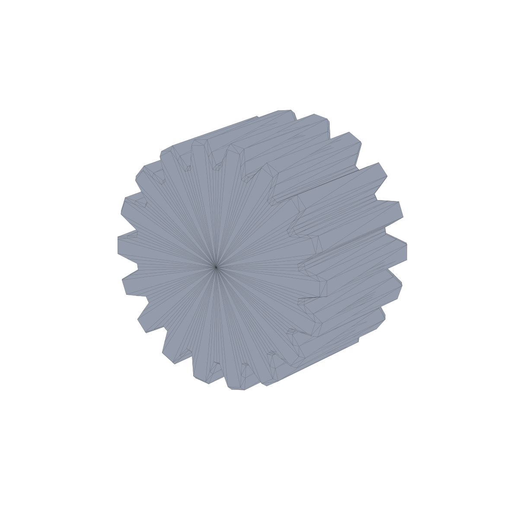

# Newton Gear Crusher — DAT Figure 8 reproduction

This package recreates the **Gear Crusher** layout from Figure 8 of *Divide and
Truncate: A Penetration and Inversion Free Framework for Coupled Multi-physics
Systems* in Newton 1.3.0.



Crusher drum detail:



## What changed from the rejected proxy version

- The soft body is now the actual **Stanford Armadillo** surface, not a
  procedurally generated ellipsoid/voxel character.
- The supplied volume asset has **15,758 vertices and 60,216 tetrahedra**, very
  close to the paper's reported 15K / 60K resolution.
- Each crusher is now a closed, beveled, **18-tooth straight-ridge drum** whose
  tooth shape, axial length, solid end cap, spacing, axis, and counter-rotation
  were reconstructed from Figure 8. There are no cube proxy crushers or guide
  cubes in the scene.
- The paper's Table 1 parameters are used: `lambda=1e6`, `mu=1e5`, contact
  stiffness `1e6`, friction `0.2`, contact radius `5 mm`, `dt=1/600 s`, and 10
  VBD iterations.

The paper does not distribute its original crusher mesh, so the gear geometry
in this package is a careful **figure-based reconstruction**, not a claim that
it is the authors' exact binary asset.

## Run

A CUDA GPU is strongly recommended for this ~59K-tet VBD example.

```bash
python -m pip install "newton[examples]==1.3.0"
python example_gear_crusher.py \
  --viewer gl \
  --device cuda:0 \
  --num-frames 300
```

Headless USD output:

```bash
python example_gear_crusher.py \
  --viewer usd \
  --device cuda:0 \
  --num-frames 300 \
  --output-path gear_crusher.usd
```

## Assets

```text
assets/
├── armadillo_stanford_tet.npz       # Newton tet vertices + tets + boundary
├── armadillo_stanford_surface.obj   # boundary surface of the tet mesh
├── crusher_drum_18t.npz             # runtime gear collision/render mesh
├── crusher_drum_18t.obj             # inspectable gear mesh
├── asset_metadata.json              # counts and paper parameters
└── source/
    └── armadillo_stanford_original.obj
```

Validate the packaged topology and counts:

```bash
python validate_assets.py
```

Regeneration requires TetGen and mesh-processing packages:

```bash
python -m pip install numpy trimesh fast-simplification tetgen matplotlib
python generate_assets.py
sha256sum -c MANIFEST.sha256
```

## Notes

- Newton's VBD implementation contains the Planar-DAT truncation kernels used
  by the particle self-contact path.
- The first startup includes graph coloring and Warp kernel compilation and can
  take noticeably longer than subsequent runs.
- The two gear meshes are intentionally excluded from gear-to-gear collision;
  their motion is prescribed and their teeth overlap slightly to produce the
  narrow crusher throat shown in the paper.

See `ATTRIBUTION.md` for the Armadillo source and asset-use notice.
